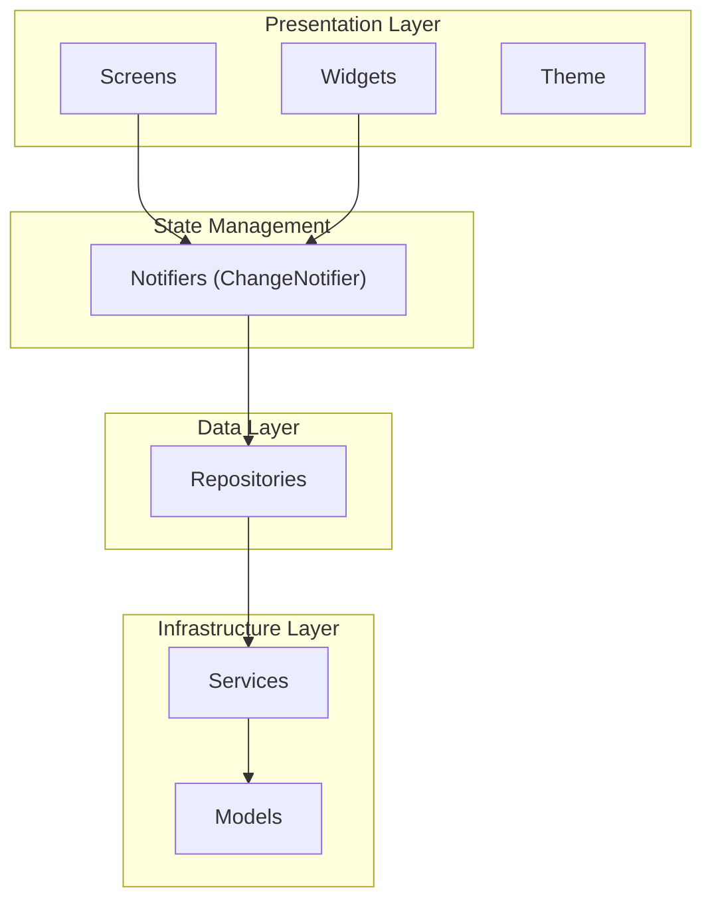
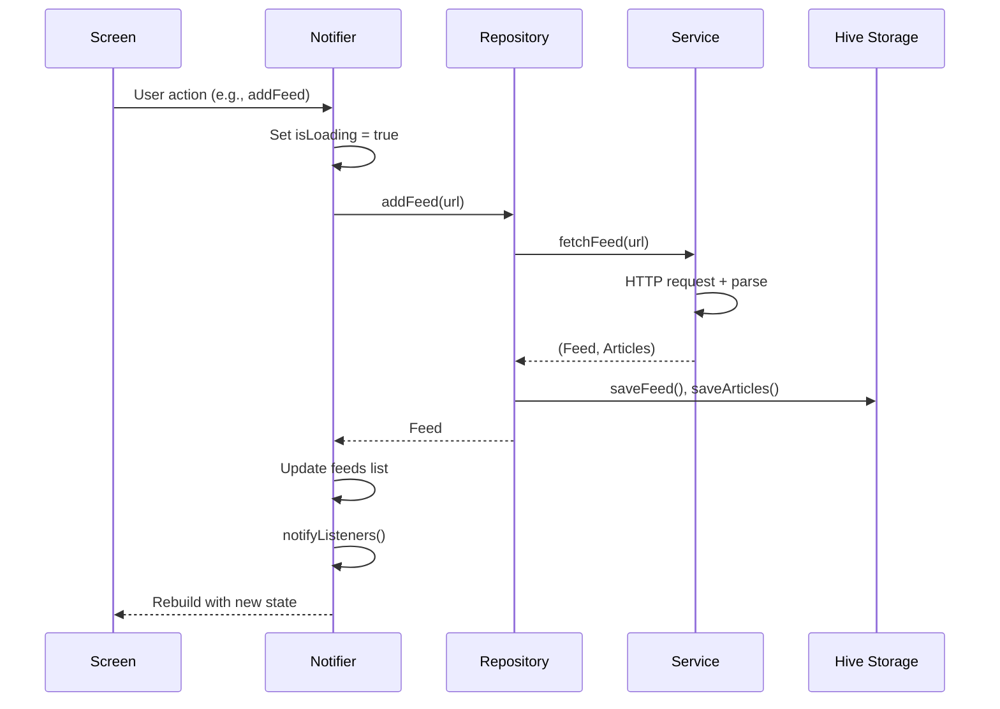

# Omit - Architecture Documentation

A minimal RSS reader app built with Flutter following Clean Architecture principles.

## Overview

Omit is an RSS/Atom feed reader that allows users to subscribe to feeds, read articles, and bookmark content for later. The app is designed for Android with offline-first capabilities using local storage.

## Technology Stack

| Category | Technology |
|----------|------------|
| Framework | Flutter |
| State Management | Provider + ChangeNotifier |
| Local Storage | Hive |
| HTTP Client | http package |
| RSS Parsing | dart_rss |
| WebView | webview_flutter |
| URL Launcher | url_launcher |

## Architecture

The app follows a **layered Clean Architecture** pattern with clear separation of concerns:



---

## Project Structure

```
lib/
├── main.dart              # App entry point & dependency injection
├── models/                # Data models with Hive adapters
│   ├── article.dart       # Article model
│   ├── feed.dart          # Feed subscription model
│   └── models.dart        # Barrel export
├── services/              # External services (HTTP, storage)
│   ├── rss_service.dart   # RSS/Atom fetching & parsing
│   ├── storage_service.dart # Hive local storage
│   └── services.dart      # Barrel export
├── repositories/          # Data access layer
│   ├── article_repository.dart
│   ├── feed_repository.dart
│   └── repositories.dart  # Barrel export
├── notifiers/             # UI state management
│   ├── article_notifier.dart
│   ├── feed_notifier.dart
│   └── notifiers.dart     # Barrel export
├── screens/               # UI screens
│   ├── feeds_screen.dart
│   ├── article_list_screen.dart
│   ├── article_detail_screen.dart
│   ├── article_webview.dart
│   ├── bookmarks_screen.dart
│   └── screens.dart       # Barrel export
├── widgets/               # Reusable widgets
│   ├── add_feed_dialog.dart
│   └── widgets.dart       # Barrel export
└── theme/                 # App theming
    └── app_theme.dart
```

---

## Layer Details

### Models

Domain entities persisted with Hive for offline storage.

| Model | Description | Hive TypeId |
|-------|-------------|-------------|
| [Feed](file:///home/mohan/Flutter/projects/omit/lib/models/feed.dart) | RSS/Atom feed subscription | 0 |
| [Article](file:///home/mohan/Flutter/projects/omit/lib/models/article.dart) | Individual feed item/article | 1 |

**Key Features:**
- `@HiveType` and `@HiveField` annotations for serialization
- `copyWith()` methods for immutable updates
- Factory constructors (e.g., `Feed.fromRss()`)

---

### Services

Low-level infrastructure services handling external I/O.

#### [RssService](file:///home/mohan/Flutter/projects/omit/lib/services/rss_service.dart)

Handles fetching and parsing RSS/Atom feeds.

| Method | Purpose |
|--------|---------|
| `fetchFeed(url)` | Fetch and parse feed, returns `(Feed, List<Article>)` |
| `validateFeed(url)` | Validate URL is a valid RSS/Atom feed |

**Internal Helpers:**
- `_parseRssFeed()` / `_parseAtomFeed()` - Format-specific parsing
- `_cleanHtml()` - Strip HTML tags from content
- `_parseDate()` / `_parseRfc822Date()` - Date parsing
- `_extractImageUrl()` - Extract images from feed items

#### [StorageService](file:///home/mohan/Flutter/projects/omit/lib/services/storage_service.dart)

Manages local Hive storage.

| Category | Methods |
|----------|---------|
| Feed Operations | `getAllFeeds()`, `getFeed()`, `saveFeed()`, `deleteFeed()` |
| Article Operations | `getArticlesForFeed()`, `getArticle()`, `saveArticle()`, `saveArticles()` |
| State Management | `markAsRead()`, `toggleBookmark()`, `getBookmarkedArticles()` |
| Utilities | `init()`, `clearAll()`, `close()` |

---

### Repositories

Pure data layer bridging services and notifiers.

> [!NOTE]
> Repositories are pure data access objects with **no UI state** (no `ChangeNotifier`).

#### [FeedRepository](file:///home/mohan/Flutter/projects/omit/lib/repositories/feed_repository.dart)

| Method | Description |
|--------|-------------|
| `loadFeeds()` | Load all feeds with unread counts |
| `addFeed(url)` | Add new feed subscription |
| `refreshFeed(feedId)` | Refresh feed articles |
| `deleteFeed(feedId)` | Delete feed and its articles |

#### [ArticleRepository](file:///home/mohan/Flutter/projects/omit/lib/repositories/article_repository.dart)

| Method | Description |
|--------|-------------|
| `getArticlesForFeed(feedId)` | Get articles for a feed |
| `markAsRead(articleId)` | Mark article as read |
| `toggleBookmark(articleId)` | Toggle bookmark status |
| `getBookmarkedArticles()` | Get all bookmarks |

---

### Notifiers

UI state management using `ChangeNotifier` pattern.

> [!TIP]
> Notifiers manage loading states, errors, and cached data lists for efficient UI updates.

#### [FeedNotifier](file:///home/mohan/Flutter/projects/omit/lib/notifiers/feed_notifier.dart)

| Property | Type | Description |
|----------|------|-------------|
| `feeds` | `List<Feed>` | Current feed list |
| `isLoading` | `bool` | Loading indicator |
| `error` | `String?` | Error message |

| Method | Description |
|--------|-------------|
| `loadFeeds()` | Load feeds from storage |
| `addFeed(url)` | Add new feed |
| `refreshFeed(feedId)` | Refresh single feed |
| `refreshAllFeeds()` | Refresh all feeds |
| `deleteFeed(feedId)` | Delete a feed |
| `updateUnreadCount(feedId, count)` | Update unread badge |

#### [ArticleNotifier](file:///home/mohan/Flutter/projects/omit/lib/notifiers/article_notifier.dart)

| Property | Type | Description |
|----------|------|-------------|
| `articles` | `List<Article>` | Current article list |
| `currentFeedId` | `String?` | Active feed ID |
| `isLoading` | `bool` | Loading indicator |

| Method | Description |
|--------|-------------|
| `loadArticlesForFeed(feedId)` | Load articles for feed |
| `markAsRead(articleId)` | Mark as read |
| `toggleBookmark(articleId)` | Toggle bookmark |
| `getBookmarkedArticles()` | Get bookmarks |
| `clear()` | Clear current state |

---

### Screens

| Screen | Description |
|--------|-------------|
| [FeedsScreen](file:///home/mohan/Flutter/projects/omit/lib/screens/feeds_screen.dart) | Main screen - list of subscribed feeds |
| [ArticleListScreen](file:///home/mohan/Flutter/projects/omit/lib/screens/article_list_screen.dart) | Articles from a selected feed |
| [ArticleDetailScreen](file:///home/mohan/Flutter/projects/omit/lib/screens/article_detail_screen.dart) | Article viewer with WebView |
| [BookmarksScreen](file:///home/mohan/Flutter/projects/omit/lib/screens/bookmarks_screen.dart) | Saved bookmarks |

---

## Dependency Injection

Dependencies are wired up in [main.dart](file:///home/mohan/Flutter/projects/omit/lib/main.dart):

```dart
void main() async {
  // 1. Initialize storage
  final storageService = StorageService();
  await storageService.init();

  // 2. Create services
  final rssService = RssService();

  // 3. Create repositories (pure data layer)
  final feedRepository = FeedRepository(
    rssService: rssService,
    storageService: storageService,
  );
  final articleRepository = ArticleRepository(storageService: storageService);

  // 4. Create notifiers (UI state layer)
  final feedNotifier = FeedNotifier(repository: feedRepository);
  final articleNotifier = ArticleNotifier(repository: articleRepository);

  // 5. Provide to widget tree
  runApp(
    MultiProvider(
      providers: [
        ChangeNotifierProvider.value(value: feedNotifier),
        ChangeNotifierProvider.value(value: articleNotifier),
        Provider.value(value: storageService),
      ],
      child: const OmitApp(),
    ),
  );
}
```

---

## Data Flow



---

## Key Design Decisions

### 1. Separation of Repositories and Notifiers

**Problem:** Mixing data access and UI state leads to tight coupling.

**Solution:** 
- `Repositories` handle pure data operations
- `Notifiers` manage UI state (loading, errors, caching)

### 2. Offline-First with Hive

**Problem:** RSS readers need offline access.

**Solution:** All data persisted to Hive immediately; network is for refresh only.

### 3. Provider for State Management

**Problem:** Need simple, efficient state management.

**Solution:** `ChangeNotifier` + `Provider` offers good performance with minimal boilerplate.

### 4. Barrel Exports

**Problem:** Import paths become unwieldy.

**Solution:** Each folder has a barrel file (e.g., `models.dart`) for clean imports.

---

## Theme

The app uses a custom [AppTheme](file:///home/mohan/Flutter/projects/omit/lib/theme/app_theme.dart) with Material 3:

- **Primary Color:** Blue (#1565C0)
- **Design:** Light theme with card-based layout
- **Typography:** System fonts with consistent sizing

---

## Future Considerations

- [ ] Dark theme support
- [ ] Background sync for new articles
- [ ] Feed categories/folders
- [ ] Search functionality
- [ ] Export/import OPML
