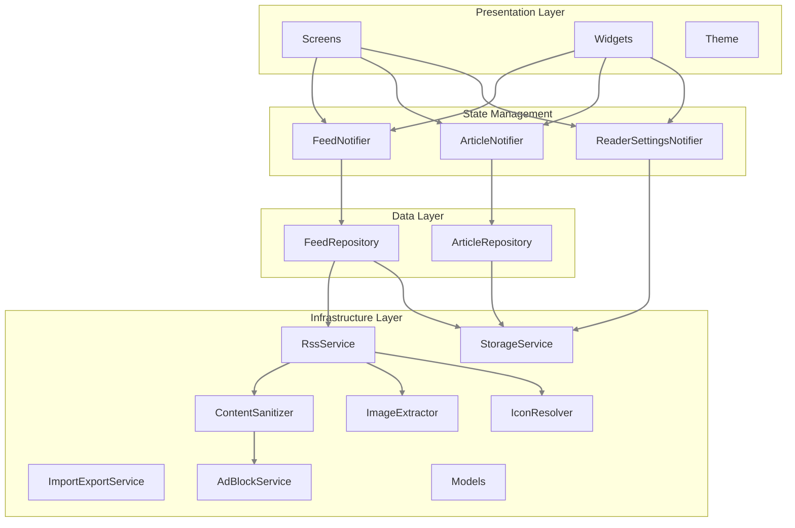
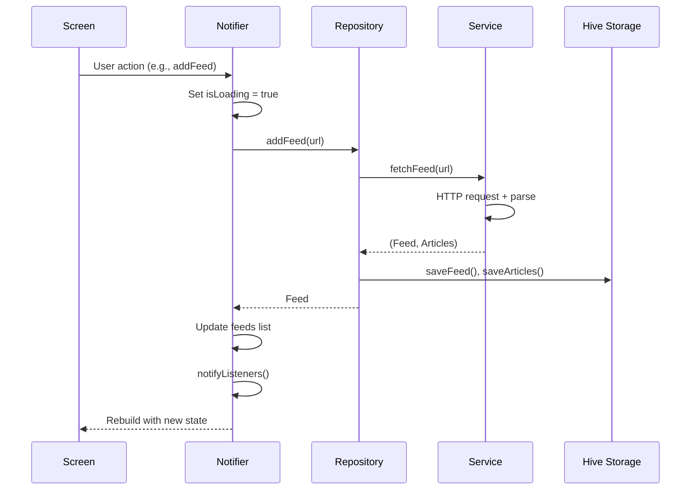

# Omit - Architecture Documentation

A minimal RSS reader app built with Flutter following Clean Architecture principles.

## Overview

Omit is an RSS/Atom feed reader that allows users to subscribe to feeds, read articles, and bookmark content for later. The app is designed for Android with offline-first capabilities using local storage.

## Technology Stack

| Category | Technology |
|----------|------------|
| Framework | Flutter |
| State Management | Provider + ChangeNotifier |
| Local Storage | Hive |
| HTTP Client | http package |
| RSS Parsing | dart_rss |
| WebView | webview_flutter + adblocker_webview |
| Image Caching | cached_network_image |
| Analysis | very_good_analysis |

## Architecture

The app follows a **layered Clean Architecture** pattern with clear separation of concerns:



**Strict Layering Rules:**
1.  **UI (Screens/Widgets)** must ONLY interact with **Notifiers**.
2.  **Notifiers** must ONLY interact with **Repositories** (or `StorageService` for settings).
3.  **Repositories** must ONLY interact with **Services** and **Models**.
4.  **Services** interact with external data sources (network, storage).
5.  **UI** should NEVER access **Repositories** or **Services** directly.

---

## Project Structure

```
lib/
├── main.dart                  # App entry point & dependency injection
├── models/
│   ├── article.dart           # Article model (immutable, Hive-backed)
│   ├── feed.dart              # Feed subscription model (immutable, Hive-backed)
│   ├── reader_settings.dart   # Reader appearance settings (font, theme, scale)
│   └── models.dart            # Barrel export
├── services/
│   ├── rss_service.dart       # RSS/Atom fetching & parsing (orchestrator)
│   ├── content_sanitizer.dart # HTML sanitization + ad filtering
│   ├── image_extractor.dart   # Image URL extraction + scoring
│   ├── icon_resolver.dart     # Favicon / site icon resolution
│   ├── storage_service.dart   # Hive local storage + in-memory index
│   ├── ad_block_service.dart  # Domain-based ad content filtering
│   ├── import_export_service.dart # Feed import/export via files
│   └── services.dart          # Barrel export
├── repositories/
│   ├── article_repository.dart
│   ├── feed_repository.dart
│   └── repositories.dart      # Barrel export
├── notifiers/
│   ├── article_notifier.dart  # Article list state
│   ├── feed_notifier.dart     # Feed list state + parallel refresh
│   ├── reader_settings_notifier.dart # Reader appearance state + persistence
│   ├── error_notifier_mixin.dart # Shared error handling mixin
│   └── notifiers.dart         # Barrel export
├── screens/
│   ├── feeds_screen.dart      # Main feed list
│   ├── article_list_screen.dart
│   ├── article_detail_screen.dart
│   ├── article_webview.dart
│   ├── reader_mode_view.dart  # Clean reader with readability.js
│   ├── bookmarks_screen.dart
│   └── screens.dart           # Barrel export
├── widgets/
│   ├── add_feed_dialog.dart
│   ├── app_drawer.dart
│   ├── cached_image.dart      # CachedImage + FilteredImage (lazy dimension check)
│   ├── error_listener.dart    # SnackBar error display via ErrorNotifierMixin
│   ├── reader_theme_sheet.dart
│   └── widgets.dart           # Barrel export
├── utils/
│   ├── date_utils.dart        # "time ago" formatting
│   ├── html_utils.dart        # Defense-in-depth HTML unescaping
│   ├── reader_js_scripts.dart # JavaScript for reader mode WebView
│   └── utils.dart             # Barrel export
└── theme/
    └── app_theme.dart         # Material 3 light theme
```

---

## Layer Details

### Models

Immutable domain entities persisted with Hive. All fields are `final` — mutations go through `copyWith()`.

| Model | Description | Hive TypeId |
|-------|-------------|-------------|
| [Feed](../lib/models/feed.dart) | RSS/Atom feed subscription | 0 |
| [Article](../lib/models/article.dart) | Individual feed item/article | 1 |
| [ReaderSettings](../lib/models/reader_settings.dart) | Reader appearance (font, theme, scale) | — (JSON in Hive) |

**Key Features:**
- `@HiveType` and `@HiveField` annotations for serialization
- All fields `final` — immutable updates via `copyWith()`
- Deterministic IDs: `Feed.generateId(url)` uses URL hash, `Article.generateId(feedId, link)` uses composite hash
- `ReaderSettings` provides shared color constants (`lightBg`, `darkBg`, `sepiaBg`, etc.)

---

### Services

Low-level infrastructure services. Each has a single, focused responsibility.

#### [RssService](../lib/services/rss_service.dart) — Orchestrator

Coordinates feed fetching and parsing by delegating to specialized services.

| Method | Purpose |
|--------|---------|
| `fetchFeed(url)` | Fetch and parse feed, returns `(Feed, List<Article>)` |
| `validateFeed(url)` | Validate URL is a valid RSS/Atom feed |

Delegates to:

| Service | Responsibility |
|---------|---------------|
| [ContentSanitizer](../lib/services/content_sanitizer.dart) | Strips HTML, decodes entities, filters ads via `AdBlockService` |
| [ImageExtractor](../lib/services/image_extractor.dart) | Extracts + scores images from `media:content`, enclosures, and HTML (no HTTP calls — synchronous) |
| [IconResolver](../lib/services/icon_resolver.dart) | Scrapes homepages for apple-touch-icon/favicon, falls back to Google Favicons API |

#### [StorageService](../lib/services/storage_service.dart)

Manages local Hive storage with an **in-memory feed-to-article index** for O(1) lookups.

| Category | Methods |
|----------|---------|
| Feed Operations | `getAllFeeds()`, `getFeed()`, `saveFeed()`, `deleteFeed()` |
| Article Operations | `getArticlesForFeed()`, `saveArticle()`, `saveArticles()` |
| State Management | `markAsRead()`, `toggleBookmark()`, `getBookmarkedArticles()` |
| Settings | `getFeedReaderMode()`, `setFeedReaderMode()` — Per-feed reader preference |
| Reader Settings | `getReaderSettings()`, `saveReaderSettings()` — Global reader appearance |
| Utilities | `init()`, `clearAll()`, `close()` |

#### [AdBlockService](../lib/services/ad_block_service.dart)

Filters ad content from RSS HTML using a curated domain blocklist.

#### [ImportExportService](../lib/services/import_export_service.dart)

Handles feed URL import/export via file picker.

---

### Repositories

Pure data layer bridging services and notifiers.

> [!NOTE]
> Repositories are pure data access objects with **no UI state** (no `ChangeNotifier`). All model mutations use `copyWith()`.

#### [FeedRepository](../lib/repositories/feed_repository.dart)

| Method | Description |
|--------|-------------|
| `loadFeeds()` | Load all feeds with computed unread counts |
| `addFeed(url)` | Add new feed subscription |
| `refreshFeed(feedId)` | Refresh feed articles, merging local state (isRead, isBookmarked) |
| `deleteFeed(feedId)` | Delete feed and its articles |
| `updateFeed(feed)` | Update feed metadata (e.g., rename) |
| `saveAllFeeds(feeds)` | Persist all feeds (used for reordering) |

#### [ArticleRepository](../lib/repositories/article_repository.dart)

| Method | Description |
|--------|-------------|
| `getArticlesForFeed(feedId)` | Get articles for a feed |
| `markAsRead(articleId)` | Mark article as read |
| `toggleBookmark(articleId)` | Toggle bookmark status |
| `getBookmarkedArticles()` | Get all bookmarks |

---

### Notifiers

UI state management using `ChangeNotifier` pattern with `ErrorNotifierMixin` for error handling.

> [!TIP]
> Each notifier has a single responsibility. Reader settings changes do NOT trigger article list rebuilds.

#### [FeedNotifier](../lib/notifiers/feed_notifier.dart)

| Property | Type | Description |
|--------|------|-------------|
| `feeds` | `List<Feed>` | Current feed list (unmodifiable) |
| `isLoading` | `bool` | Loading indicator |

| Method | Description |
|--------|-------------|
| `loadFeeds()` | Load feeds from storage |
| `addFeed(url)` | Add new feed |
| `refreshFeed(feedId)` | Refresh single feed |
| `refreshAllFeeds()` | Refresh all feeds **in parallel** via `Future.wait()` |
| `deleteFeed(feedId)` | Delete a feed |
| `renameFeed(feedId, title)` | Rename a feed (optimistic update) |
| `reorderFeeds(old, new)` | Reorder feeds via drag-and-drop |
| `updateUnreadCount(feedId, count)` | Update unread badge |

#### [ArticleNotifier](../lib/notifiers/article_notifier.dart)

| Property | Type | Description |
|--------|------|-------------|
| `articles` | `List<Article>` | Current article list (filtered by read status) |
| `currentFeedId` | `String?` | Active feed ID |
| `isLoading` | `bool` | Loading indicator |
| `showUnreadOnly` | `bool` | Read/unread filter toggle |

| Method | Description |
|--------|-------------|
| `loadArticlesForFeed(feedId)` | Load articles for feed |
| `markAsRead(articleId)` | Mark as read |
| `toggleBookmark(articleId)` | Toggle bookmark |
| `toggleReadFilter()` | Toggle unread-only filter |
| `getBookmarkedArticles()` | Get bookmarks |
| `getFeedReaderMode(feedId)` | Get per-feed reader mode preference |
| `setFeedReaderMode(feedId, isEnabled)` | Set per-feed reader mode preference |

#### [ReaderSettingsNotifier](../lib/notifiers/reader_settings_notifier.dart)

Manages reader appearance independently from article state.

| Property | Type | Description |
|--------|------|-------------|
| `settings` | `ReaderSettings` | Current reader settings |

| Method | Description |
|--------|-------------|
| `loadSettings()` | Restore settings from Hive |
| `updateSettings(...)` | Update font/theme/size and persist to Hive |

---

### Screens

| Screen | Description |
|--------|-------------|
| [FeedsScreen](../lib/screens/feeds_screen.dart) | Main screen — reorderable feed list with pull-to-refresh |
| [ArticleListScreen](../lib/screens/article_list_screen.dart) | Articles from a selected feed |
| [ArticleDetailScreen](../lib/screens/article_detail_screen.dart) | Container for article viewing (toggles WebView/Reader) |
| [ReaderModeView](../lib/screens/reader_mode_view.dart) | Clean reader using readability.js with dynamic theme updates |
| [ArticleWebView](../lib/screens/article_webview.dart) | Full web page view with ad blocking |
| [BookmarksScreen](../lib/screens/bookmarks_screen.dart) | Saved bookmarks with swipe-to-remove |

---

## Dependency Injection

Dependencies are wired up in [main.dart](../lib/main.dart):

```dart
void main() async {
  // 1. Initialize storage + ad blocking
  final storageService = StorageService();
  await storageService.init();
  final adBlockService = AdBlockService();
  await adBlockService.initialize();

  // 2. Create decomposed services
  final contentSanitizer = ContentSanitizer(adBlockService: adBlockService);
  final imageExtractor = ImageExtractor();
  final iconResolver = IconResolver();
  final rssService = RssService(
    contentSanitizer: contentSanitizer,
    imageExtractor: imageExtractor,
    iconResolver: iconResolver,
  );

  // 3. Create repositories (pure data layer)
  final feedRepository = FeedRepository(rssService: rssService, storageService: storageService);
  final articleRepository = ArticleRepository(storageService: storageService);

  // 4. Create notifiers (UI state layer)
  final feedNotifier = FeedNotifier(repository: feedRepository);
  final articleNotifier = ArticleNotifier(repository: articleRepository);
  final readerSettingsNotifier = ReaderSettingsNotifier(storageService: storageService)
    ..loadSettings();

  // 5. Provide to widget tree
  runApp(
    MultiProvider(
      providers: [
        ChangeNotifierProvider.value(value: feedNotifier),
        ChangeNotifierProvider.value(value: articleNotifier),
        ChangeNotifierProvider.value(value: readerSettingsNotifier),
        Provider.value(value: storageService),
        Provider.value(value: importExportService),
      ],
      child: const OmitApp(),
    ),
  );
}
```

---

## Data Flow

See [SEQUENCE_DIAGRAMS.md](SEQUENCE_DIAGRAMS.md) for detailed sequence diagrams covering:

1. **Adding a feed** — full service orchestration
2. **Refreshing all feeds** — parallel via `Future.wait()`
3. **Reading an article** — WebView + Reader Mode with dynamic theme
4. **Bookmarking an article** — immutable updates via `copyWith()`
5. **Import/export feeds** — file-based flow
6. **Dependency injection** — startup initialization order

### Summary Flow



---

## Key Design Decisions

### 1. Separation of Repositories and Notifiers

**Problem:** Mixing data access and UI state leads to tight coupling.

**Solution:** 
- `Repositories` handle pure data operations
- `Notifiers` manage UI state (loading, errors, caching)

### 2. Offline-First with Hive

**Problem:** RSS readers need offline access.

**Solution:** All data persisted to Hive immediately; network is for refresh only. In-memory index (`feedId → articleIds`) provides O(1) lookups.

### 3. Decomposed Services (Single Responsibility)

**Problem:** Monolithic `RssService` (585 lines) mixed HTTP, parsing, sanitization, image extraction, and icon resolution.

**Solution:** Split into focused classes (`ContentSanitizer`, `ImageExtractor`, `IconResolver`) each with a single concern. `RssService` orchestrates them.

### 4. Lazy Image Validation

**Problem:** Validating image dimensions during feed parsing required sequential HTTP requests (downloading bytes per image).

**Solution:** `ImageExtractor` is synchronous (no HTTP calls). Image dimension validation happens lazily at display time via `FilteredImage` widget, which uses the image cache.

### 5. Immutable Models

**Problem:** Mutable fields on Hive models allow direct mutation that bypasses `notifyListeners()`.

**Solution:** All `Article` and `Feed` fields are `final`. Updates use `copyWith()` + `box.put()` instead of `field = value` + `save()`.

### 6. Separated Reader Settings

**Problem:** `ArticleNotifier` managed both article state and reader settings, causing font changes to rebuild the article list.

**Solution:** `ReaderSettingsNotifier` owns reader appearance state independently. Settings persist to Hive as JSON.

### 7. Barrel Exports

**Problem:** Import paths become unwieldy.

**Solution:** Each folder has a barrel file (e.g., `models.dart`) for clean imports.

### 8. Global HTML Sanitization

**Problem:** HTML entities (e.g., `&amp;`) appearing in UI text fields.

**Solution:** `ContentSanitizer` sanitizes all text at the ingestion point. `HtmlUtils.unescape()` provides defense-in-depth at the UI layer.

---

## Theme

The app uses a custom [AppTheme](../lib/theme/app_theme.dart) with Material 3:

- **Primary Color:** Blue (#1565C0)
- **Design:** Light theme with card-based layout
- **All colors via `Theme.of(context).colorScheme`** — no hardcoded hex values in UI
- Reader mode has its own theme defined by `ReaderSettings` constants

---

## Future Considerations

- [ ] Dark theme support (all UI already uses theme tokens)
- [ ] Background sync for new articles
- [ ] Feed categories/folders
- [ ] Search functionality
- [ ] Export/import OPML format
