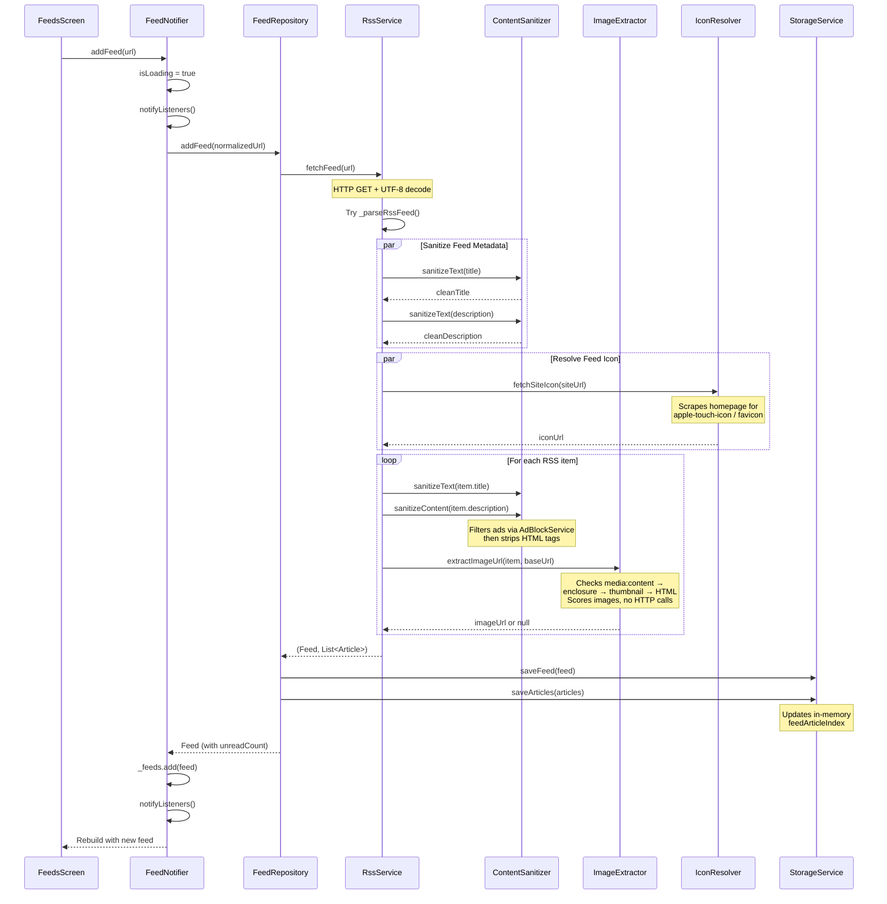
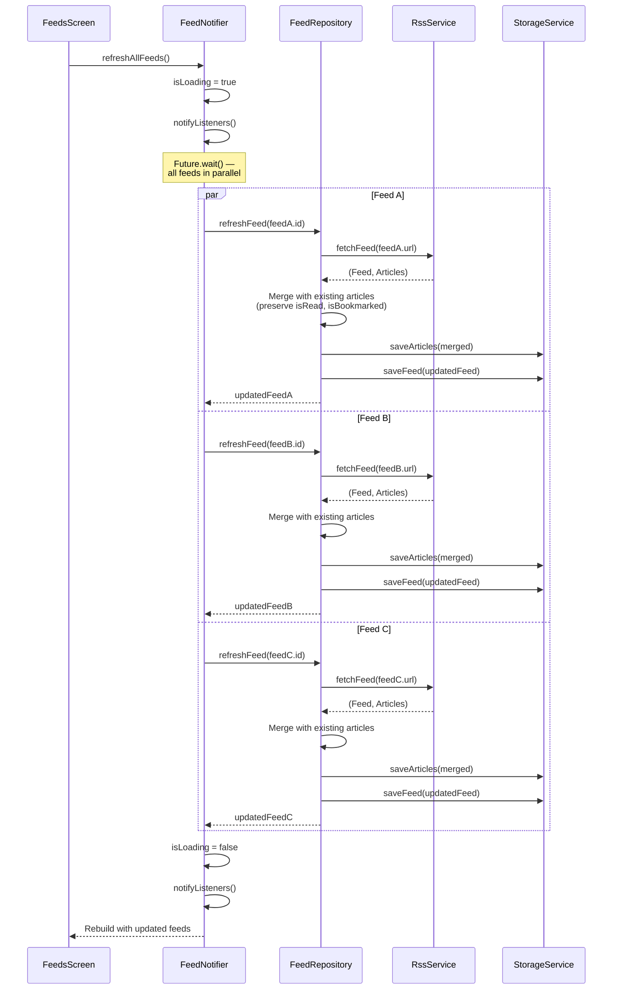
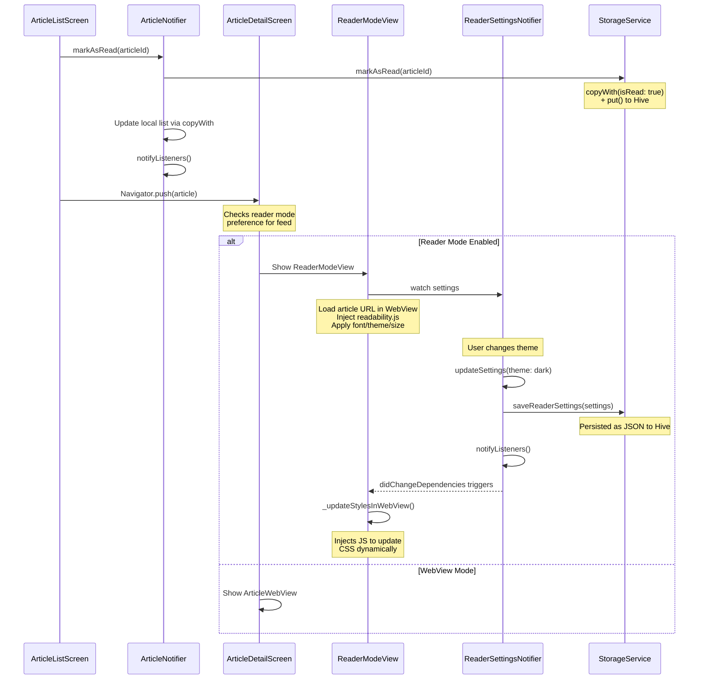
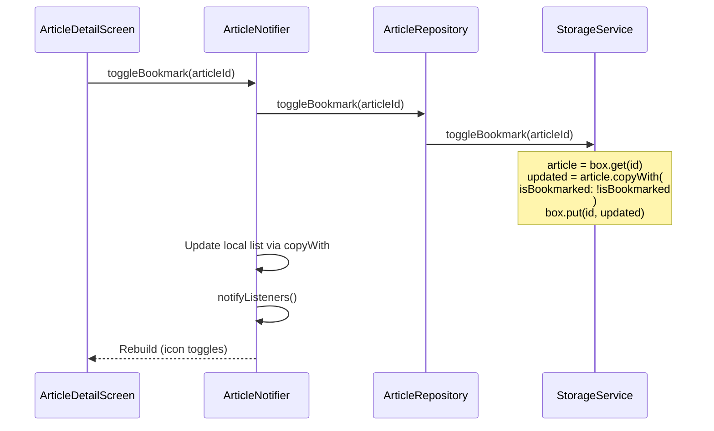
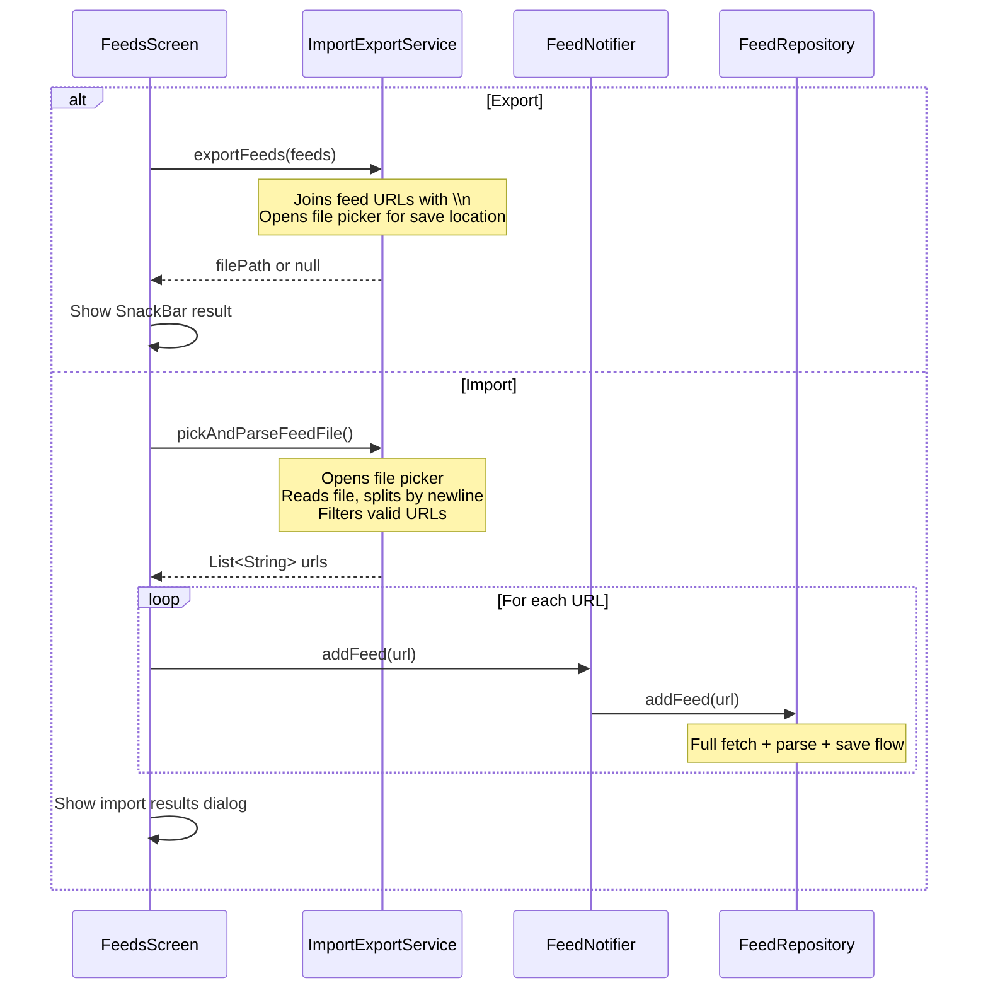
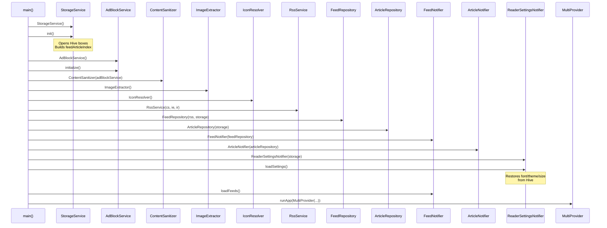

# Omit — Sequence Diagrams

Detailed data flow diagrams for the core user journeys.

---

## 1. Adding a Feed

The most complex flow in the app. Shows how the decomposed service classes collaborate.

---

## 2. Refreshing All Feeds (Parallel)

Shows the concurrent refresh strategy.

---

## 3. Reading an Article (WebView + Reader Mode)

---

## 4. Bookmarking an Article

---

## 5. Import / Export Feeds

---

## 6. Dependency Injection (Startup)

